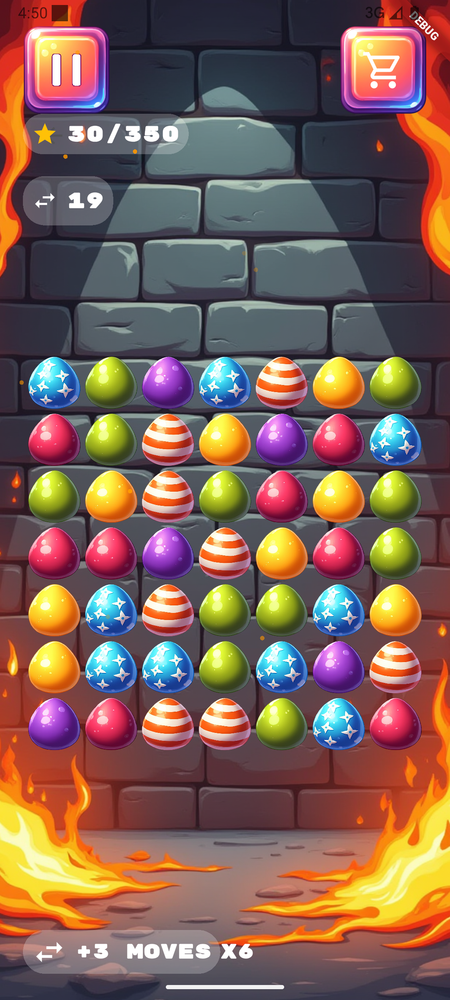
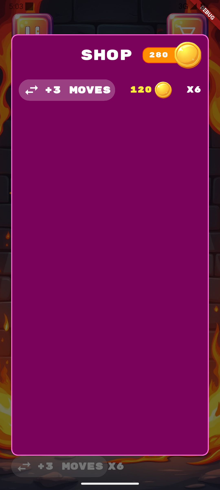

# 🐔 RoosterGame


A mobile match-3 game developed with Flutter and Flame Engine.





## 📋 Description


RoosterGame is a full-featured mobile game with a level system, user profile, shop, leaderboard, and settings. The game implements classic match-3 mechanics where the player connects eggs in rows to earn points.


### ✨ Key Features


- 🎮 **9 unique levels** with progressive difficulty increase

- 👤 **Profile system** with editable name and avatar

- 🏆 **Leaderboard** tracking best scores

- 🛒 **In-game shop** to purchase additional attempts

- ⚙️ **Settings** for sound, vibration, and notifications

- 💾 **Progress saving** using SharedPreferences

- 🎨 **Adaptive design** for different screen sizes


## 🛠 Technologies


- **Flutter 3.x** — main framework

- **Flame Engine** — for game mechanics

- **BLoC** — state management

- **SharedPreferences** — local data storage

- **Dart** — programming language


## 📱 Supported Platforms


- ✅ iOS 16+

- ✅ Android


## 🚀 Installation and Launch


### Requirements


- Flutter SDK 3.x or higher

- Dart SDK

- Xcode (for iOS)

- Android Studio (for Android)


### Installation Steps


1. **Clone repository**

```bash

git clone github.com:h3ng3ll/rooster_game.git

cd rooster_game

```


2. **Install dependencies**

```bash

flutter pub get

dart run build_runner build -d

```


3. **Run the app**


For iOS:

```bash

flutter run -d ios

```


For Android:

```bash

flutter run -d android

```


## 🎮 Game Mechanics


### Game Rules


1. Connect 3 or more eggs of the same color in a row (vertically or horizontally)

2. On successful match, eggs disappear and you earn points

3. New eggs fall from the top to fill empty spaces

4. Reach the required score before running out of attempts


### Level System


**Levels 1-3 (Tutorial)**

- Unlimited attempts

- Small field size (4x4 - 6x6)

- Low passing threshold (50-200 points)


**Levels 4-6 (Classic)**

- Limited attempts (16-20)

- Large field (7x7)

- Ability to buy additional attempts

- Medium threshold (350-550 points)


**Levels 7-9 (Hard)**

- Each move decreases attempts

- High passing threshold (700-950 points)

- Requires precise strategy


## 📂 Project Structure


```

lib/

├── src/

│ ├── bloc/ # BLoC for state management

│ ├── databases/ # SharedPreferences

│ ├── models/ # Data models

│ ├── pages/ # App screens

│ │ ├── splash_page/ # Loading screen

│ │ ├── menu_page/ # Main menu

│ │ ├── profile_page/ # User profile

│ │ ├── settings_page/ # Settings

│ │ ├── game_page/ # Game screen

│ │ ├── leader_page/ # Leaderboard

│ │ └── ...

│ ├── services/ # Services (audio, vibration, notifications)

│ ├── widgets/ # Reusable widgets

│ └── resources/ # Colors, constants

└── main.dart

```


## 🎨 Design


Design created in Figma:

[Figma Link](https://www.figma.com/design/KqZFm2ihoJlXv8DUFzzjsu/Test-task?node-id=0-1&t=40sMk2AW1QtFA5no-1)


## 📸 Screenshots





*Add more screenshots of different game screens*


## 🔧 Configuration


### GameConfig


Each level is configured through `GameConfig`:


```dart

GameConfig(

gridSize: 7, // Field size (NxN)

tries: 20, // Number of attempts

demandScore: 350, // Required score

canByAttempts: true, // Ability to buy attempts

calculateAttemptAtMoves: false  // Penalty for each move

);

```


## 💰 Shop


**Starting balance:** 1000 coins


**Available items:**

- +3 attempts — 120 coins


## 🏆 Implementation Features


- ✅ Adaptive layout for different screens

- ✅ Progress saving system

- ✅ Smooth animations and transitions

- ✅ Sound effects and background music

- ✅ Haptic feedback

- ✅ Push notifications on record breaking

- ✅ Dynamic element falling

- ✅ Level unlocking system


## 📝 License


This project was created as a test assignment.


## 👨‍💻 Author


**Alexandr Naumenko**


## 📞 Contact


For questions and suggestions, please contact via GitHub Issues.


---


**Made with ❤️ using Flutter**
